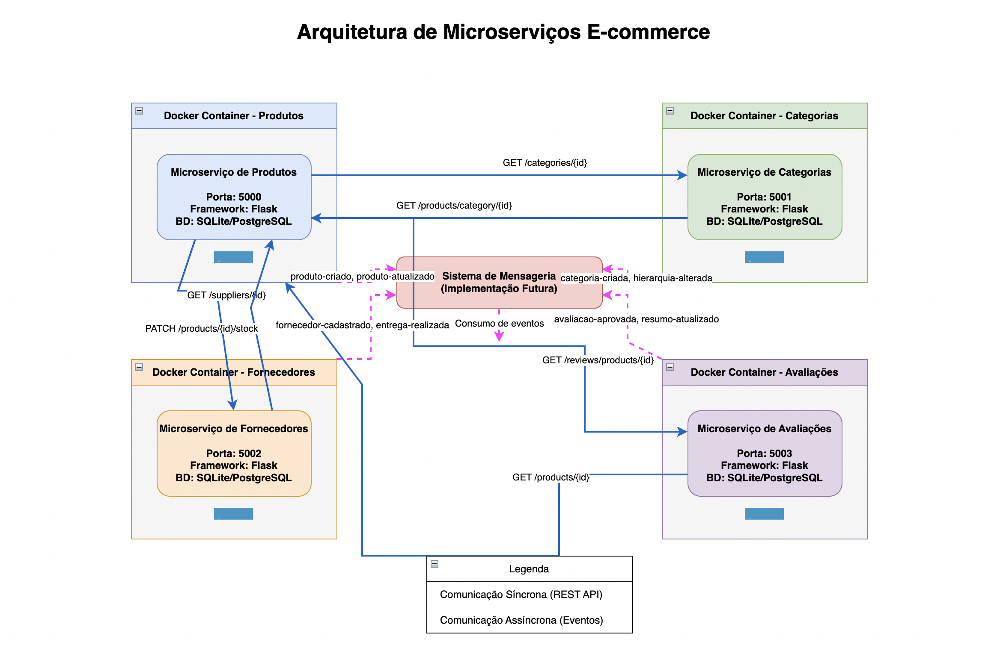

# E-COMMERCE MICROSERVICES

Sistema de e-commerce baseado em microserviços para gerenciamento de produtos, categorias, fornecedores e avaliações.

## Arquitetura de Microserviços

O projeto é composto por quatro microserviços independentes que se comunicam entre si:

1. **Microserviço de Produtos**: Gerencia o catálogo de produtos, incluindo detalhes, preços e estoque
2. **Microserviço de Categorias**: Gerencia a hierarquia de categorias e seus atributos
3. **Microserviço de Fornecedores**: Gerencia fornecedores, contatos e entregas
4. **Microserviço de Avaliações**: Gerencia avaliações de produtos e seus resumos



## Tecnologias Utilizadas

- **Backend**: Python 3.10 com Flask
- **Banco de Dados**: SQLite (desenvolvimento), PostgreSQL (produção)
- **Containerização**: Docker
- **Webserver**: Gunicorn
- **ORM**: SQLAlchemy
- **Comunicação**: REST APIs

## Requisitos

- Python 3.10+
- Docker e Docker Compose
- Git

## Estrutura do Projeto

```
E-COMMERCE-MICROSERVICES/
├── services/
│   ├── categories/
│   │   ├── app.py
│   │   ├── Dockerfile
│   │   └── requirements.txt
│   ├── products/
│   │   ├── app.py
│   │   ├── Dockerfile
│   │   └── requirements.txt
│   ├── reviews/
│   │   ├── app.py
│   │   ├── Dockerfile
│   │   └── requirements.txt
│   └── suppliers/
│       ├── app.py
│       ├── Dockerfile
│       └── requirements.txt
├── .gitignore
└── README.md
```

## Comunicação entre Serviços

### Comunicações Síncronas (API REST)

Os microserviços se comunicam diretamente via chamadas HTTP para operações que necessitam de resposta imediata:

#### Produtos → Categorias
- `GET /categories/{id}`: Para validar se a categoria existe ao cadastrar/atualizar um produto
- `GET /categories/hierarchy`: Para obter árvore de categorias
- `GET /categories/attributes/{id}`: Para obter atributos de uma categoria

#### Produtos → Fornecedores
- `GET /suppliers/{id}`: Para validar se um fornecedor existe
- `GET /suppliers/{id}/products`: Para listar produtos de um fornecedor

#### Produtos → Avaliações
- `GET /reviews/products/{id}`: Para obter avaliações de um produto
- `GET /reviews/products/{id}/summary`: Para obter resumo de avaliações

#### Categorias → Produtos
- `GET /products/category/{id}`: Para listar produtos de uma categoria

#### Fornecedores → Produtos
- `PATCH /products/{id}/stock`: Para atualizar estoque após uma entrega
- `PATCH /products/{id}/price`: Para atualizar preço quando há alteração de custo

#### Avaliações → Produtos
- `GET /products/{id}`: Para obter detalhes do produto ao exibir avaliações

### Comunicações Assíncronas (Futuro)

Em um ambiente de produção, estes serviços seriam integrados através de sistemas de mensageria como:

- Amazon SNS/SQS
- RabbitMQ
- Apache Kafka

Os tópicos de eventos seguiriam o padrão descrito abaixo:

- **Produtos**: produto-criado, produto-atualizado, estoque-alterado, preco-alterado
- **Categorias**: categoria-criada, categoria-atualizada, hierarquia-alterada
- **Fornecedores**: fornecedor-cadastrado, entrega-realizada, fornecedor-inativado
- **Avaliações**: avaliacao-aprovada, resumo-atualizado, avaliacao-destacada

## Diagrama de Comunicação entre Microserviços

```
+----------------+      REST       +----------------+
|                | --------------> |                |
|    Produtos    |                 |   Categorias   |
|                | <-------------- |                |
+----------------+                 +----------------+
        |                                  |
        | REST                             | REST
        |                                  |
        v                                  v
+----------------+      REST       +----------------+
|                | --------------> |                |
|  Fornecedores  |                 |   Avaliações   |
|                | <-------------- |                |
+----------------+                 +----------------+
```

## Como Executar

### Usando Docker (Recomendado)

1. Clone o repositório:
   ```
   git clone https://github.com/seu-usuario/e-commerce-microservices.git
   cd e-commerce-microservices
   ```

2. Crie o arquivo docker-compose.yml com o seguinte conteúdo:
   ```yaml
   version: '3'
   
   services:
     products:
       build: ./services/products
       ports:
         - "5000:5000"
       environment:
         - DATABASE_URL=sqlite:///products.db
       volumes:
         - ./services/products:/app
   
     categories:
       build: ./services/categories
       ports:
         - "5001:5001"
       environment:
         - DATABASE_URL=sqlite:///categories.db
       volumes:
         - ./services/categories:/app
   
     suppliers:
       build: ./services/suppliers
       ports:
         - "5002:5002"
       environment:
         - DATABASE_URL=sqlite:///suppliers.db
       volumes:
         - ./services/suppliers:/app
   
     reviews:
       build: ./services/reviews
       ports:
         - "5003:5003"
       environment:
         - DATABASE_URL=sqlite:///reviews.db
       volumes:
         - ./services/reviews:/app
   ```

3. Execute os serviços:
   ```
   docker-compose up -d
   ```

4. Verifique se os serviços estão rodando:
   ```
   docker-compose ps
   ```

### Sem Docker (Desenvolvimento)

Para executar cada serviço individualmente:

1. Navegue até o diretório do serviço:
   ```
   cd services/products
   ```

2. Instale as dependências:
   ```
   pip install -r requirements.txt
   ```

3. Execute o aplicativo:
   ```
   flask run --port=5000
   ```

4. Repita os passos acima para cada serviço, alterando o diretório e a porta.

## Testando os Serviços

Você pode verificar se os serviços estão funcionando usando:

- Produtos: http://localhost:5000/health
- Categorias: http://localhost:5001/health
- Fornecedores: http://localhost:5002/health
- Avaliações: http://localhost:5003/health

## Desenvolvimento Futuro

- Implementar sistema de mensageria para comunicação assíncrona
- Adicionar autenticação e autorização
- Implementar gateway de API
- Adicionar testes automatizados
- Configurar CI/CD
- Migrar para bancos de dados específicos para cada serviço

## Licença

Este projeto está licenciado sob a licença MIT - consulte o arquivo LICENSE para obter detalhes.